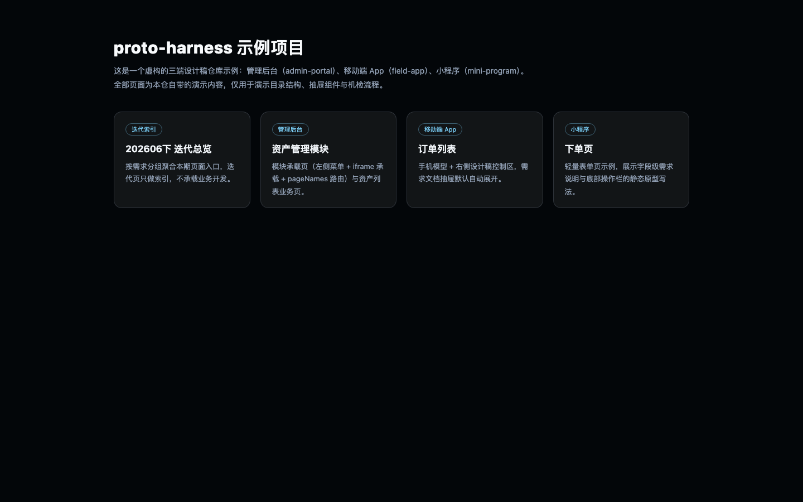
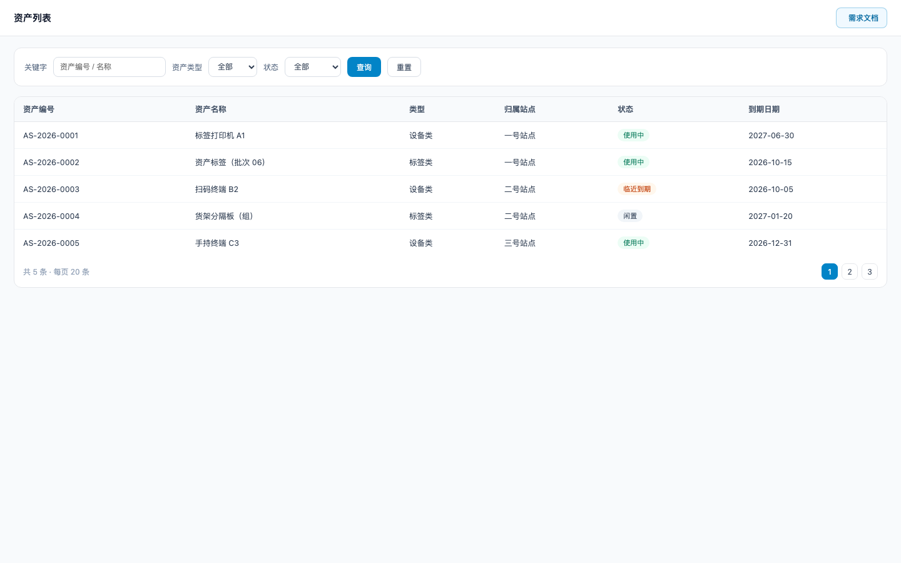
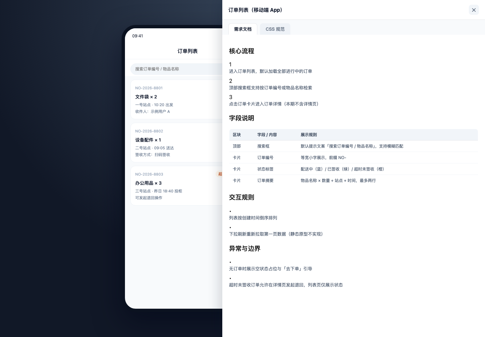

# proto-harness

**面向「目录型设计稿仓库」的治理工作流内核：一套 AI 协作规则 + 可机检的结构化标准 + 零依赖脚本 + 自带虚构示例。**

---

## 这个仓库解决什么问题

当一个仓库同时承载多端（Web 后台 / App / 小程序）、多迭代、成百上千个 HTML 静态原型时，最常见的问题不是「写页面」，而是**约束落不落得地**：

1. **规则只存在于人的脑子里**：抽屉怎么开、哪些按钮不能加、迭代页能不能写业务——没有可执行的约束。
2. **AI 协作不可控**：AI 改得又快又偏，没有开工闸门、执行依据、越权红线，也没有可验证的交付证据。
3. **入口失控**：新页面写完了但没有挂进源目录菜单、没有登记、没有纳入机检，几个月后没人知道哪些页面是活的。
4. **历史被污染**：历史迭代快照引用着仍在演进的活页面，口径随时漂移。

proto-harness 把这些问题抽象成三层可复用资产：

| 层 | 内容 | 位置 |
| --- | --- | --- |
| 规则层 | AI 主入口、强制闸门、角色路由、任务契约、纠偏与接力 | `AGENTS.md` + `harness/` |
| 标准层 | 页面登记、抽屉结构、页面类型、平台规则、设计 token | `standards/*.json` + `standards/*.md` |
| 工具层 | 机检、登记、缓存刷新、本地服务、搜索索引、脚手架 | `scripts/*` + `assets/*` |

三层的分工是：**规则层**规定动手前必须完成状态判定（分析 / 讨论 / 执行 / 排障 / 治理）、必须通过开工闸门，并按角色路由与红线（未授权不得重构、历史迭代不得引用活页）约束越界行为；**标准层**把同一批约定改写成机器可读的数据，其中还包括一份授权词表，用来判断一条消息到底有没有真的给出修改许可；**工具层**用这些标准反过来检查仓库本身。

规则之所以可信，是因为它有人执行：页面没登记、抽屉口径偏了，`npm run check:ui` 就会失败；治理机制自身另有 `node --test` 覆盖 321 项回归测试。

**刻意不包含的能力**：部署配置、服务器地址、上传脚本。分发方式与缓存策略由使用方自己的环境决定。

---

## 快速开始

```bash
git clone <本仓库地址> proto-harness
cd proto-harness

# 环境：Node.js >= 18。核心链路零第三方依赖 —— 不需要 npm install。

# 1) 机检示例项目（登记 → 样式与结构检查 → 一致性审计）
npm run check:ui

# 2) 跑治理机制自身的回归测试（321 项）
node --test

# 3) 本地预览（默认 http://127.0.0.1:18765/）
npm run serve:local
# 打开 index.html 进入示例项目总导航
```

预期输出：

```text
[register-missing] no missing html pages
[register-missing] total registered: 5
[lint-ui] OK (5 pages checked)
[audit-ui] scanned 5 html files
[audit-ui] found 0 issues
```

> `node --test` 请用**无参**形式（自动发现）。带 glob 的 `node --test 'tests/**/*.test.js'` 需要 Node 21 以上，本仓库 CI 覆盖 Node 18 / 20 / 22。
> 唯一需要安装依赖的命令是 `npm run convert:docx`（Markdown 转 DOCX，依赖 `docx`）；其余全部零依赖。

### 用真实项目接入

1. 复制 `governance.config.example.json` 为 `governance.config.json`，声明你的平台目录（如 `admin-portal` / `field-app`）、迭代目录（如 `迭代索引`）与扫描清单。字段含义见 [`docs/README.md` 的接入指南](docs/README.md#接入自己的项目)。
2. 用 `npm run scaffold:page` 生成页面骨架，按 `standards/ui-spec.json` 的口径登记。
3. 把 `AGENTS.md` + `harness/` 作为你的 AI 协作规则入口；`standards/*` 作为机检口径。

未提供 `governance.config.json` 时，脚本回退到内置的虚构三端默认值（`admin-portal` / `field-app` / `mini-program`），可直接跑通仓库自带示例。

---

## 示例项目

仓库自带的示例是**完全虚构**的演示项目（示例数据均为虚构，不含任何真实业务信息）：

| 入口 | 说明 |
| --- | --- |
| `index.html` | 总导航：迭代索引 + 三端示例页入口 |
| `迭代索引/202606下.html` | 迭代索引：只做入口聚合，不写业务 |
| `admin-portal/asset-admin/index.html` | 模块承载页：左侧菜单 + iframe 承载 + `pageNames` 路由 |
| `admin-portal/asset-admin/pages/资产列表.html` | Web 列表页：筛选 + 表格 + 手动需求抽屉 |
| `field-app/main/pages/订单列表.html` | 移动端页：手机模型 + 右侧控制区 + 自动展开抽屉 |
| `mini-program/main/pages/下单.html` | 小程序页：轻量表单 + 底部操作栏 |

### 长什么样

总导航 —— 迭代索引与三端入口聚合在一页：



Web 列表页 —— 标准筛选区 + 主表 + 状态标签，右上角是需求文档入口（默认手动打开）：



移动端页 —— 左侧手机模型，右侧自动展开的需求文档抽屉（「需求文档 / CSS 规范」双标签页）：



三张图均为仓库自带虚构示例的真实渲染结果（用无头 Chrome 采集，页面由 `npm run serve:local` 起服务提供）。

「需求文档抽屉」由公共组件 `assets/js/components/doc-panel.js` 提供：页面声明 `window.DocsData` 后，一个按钮即可获得「需求文档 / CSS 规范」双标签页抽屉。

---

## 目录结构

```text
proto-harness/
├── AGENTS.md              # AI 协作唯一主入口
├── CLAUDE.md              # Claude 接入入口（指向 AGENTS.md）
├── DEVELOPMENT.md         # 页面实现基线（结构 / 抽屉 / 弹层 / 静态原型）
├── CHANGELOG.md           # 版本记录与已知限制
├── CONTRIBUTING.md        # 提交前检查与改动边界
├── SECURITY.md            # 安全政策与漏洞上报方式
├── harness/               # AI 执行规则分卷（闸门 / 契约 / 纠偏 / 验证 / 角色 / 风格基线）
├── standards/             # 结构化标准与机检口径（JSON + 说明文档）
├── scripts/               # 零依赖 Node 脚本（机检 / 登记 / 审计 / 服务 / 脚手架）
├── assets/                # 公共 CSS / JS / 字体（抽屉组件、侧栏、搜索索引等）
├── templates/             # 页面与文档模板（用法见 templates/README.md）
├── tests/                 # Node 原生测试（治理机制回归）
├── docs/                  # 命令参考、规则导读、skills、示例截图
├── .github/               # CI 工作流、议题与合并请求模板
├── governance.config.example.json
├── LICENSE / NOTICE       # MIT 主体许可 + 第三方资源与许可声明
└── (示例项目) index.html / 迭代索引/ / admin-portal/ / field-app/ / mini-program/
```

## 常用命令

| 命令 | 作用 |
| --- | --- |
| `npm run check:ui` | 自动登记缺失页面 + `lint:ui` + `audit:ui`（日常主检查） |
| `node --test` | 治理机制回归测试（321 项）。用无参形式，见上方快速开始 |
| `npm run lint:ui` | 页面结构机检（登记、模板边界、抽屉模式、遮罩） |
| `npm run audit:ui` | 一致性审计（抽屉宽度、状态标签、设计稿文案越界） |
| `npm run register:missing:write` | 把新 HTML 页面自动登记进 `standards/ui-spec.json` |
| `npm run scaffold:page` | 按页面类型生成骨架并登记 |
| `npm run cache:bust:write` | 给 CSS/JS 引用写入内容 hash（部署前执行） |
| `npm run serve:local` | 本地静态服务（默认端口 18765） |
| `npm run check:all` | 全量检查（规则引用 + 机检 + 文档 + 治理审计） |
| `npm run harness:contracts:validate` | 契约校验（schema + fixtures） |
| `npm run harness:qualify` | 准入矩阵运行 |

完整命令表（48 个脚本，含全部 `harness:*` 子命令与别名说明）见 [`docs/README.md`](docs/README.md)。

## 规则体系导读

1. **`AGENTS.md`** —— 唯一主入口：握手、状态判定、开工闸门、红线、交付边界。
2. **`harness/`** —— 分卷细则，按任务路由读取（`harness/README.md` 有任务路由表）。
3. **`standards/`** —— 机检口径与结构化标准（页面登记、抽屉结构、平台规则）。
4. **`DEVELOPMENT.md`** —— 页面实现基线（写页面/改页面前读）。
5. **`docs/README.md`** —— 全部命令参考与接入指南。
6. **`docs/skills/`** —— 可复用的 AI 工作流 skills（诊断、评审、拆解、收尾）。

## 版本状态

当前 `v0.1.0`。设计目标是小范围稳定，而非快速扩张接口面：规则与机检口径已经过一轮内部项目验证，但**尚未有多个外部项目的接入反馈**，`standards/*` 的具体阈值与目录约定可能仍带原项目的形状。

已知限制完整列在 [`CHANGELOG.md`](CHANGELOG.md#已知限制)，其中两条影响接入判断：

- 示例里的治理语料 `tests/harness/fixtures/corpus/corpus.json` 是合成夹具，无法由 `harness:corpus:build` 从你自己的仓库结构复现 —— 该命令目前只对与本仓库结构相近的项目有意义。
- 部分规则文档描述的模块目录超出示例实际收录范围，照文档找不到页面时以 `standards/ui-spec.json` 的登记为准。

---

## 许可

[MIT](LICENSE) © 2026 amonastic。

本仓库包含改编自 MIT 许可开源项目的 skills 与第三方字体/依赖，版权声明与许可条件见 [`NOTICE`](NOTICE)。
